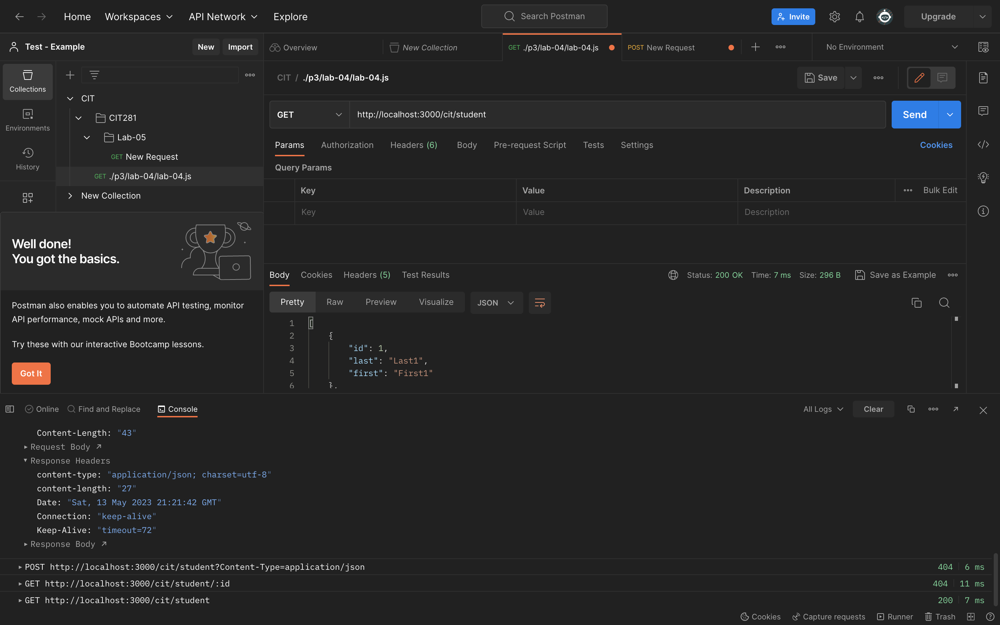
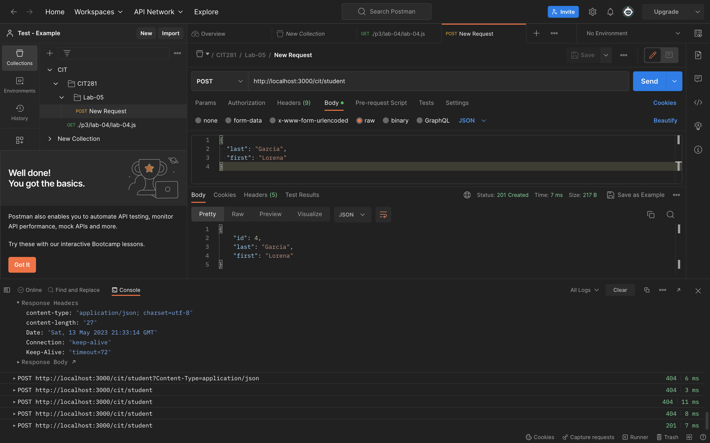
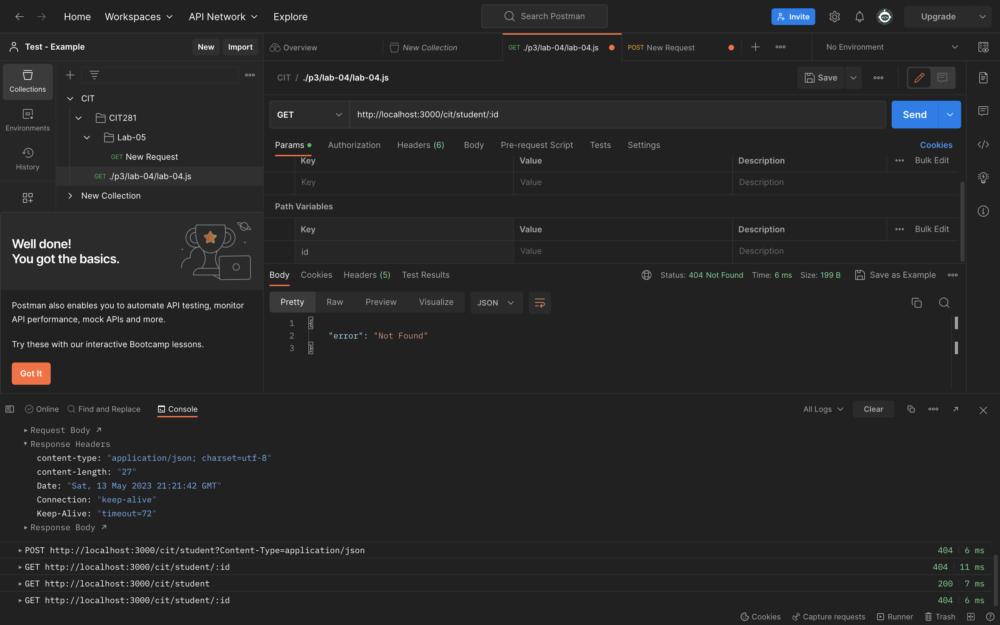

In lab 5, I learned how to work with Postman and create a Node.js and Fastify server application! 

I first downloaded and installed Postman. I then created a collection of folders specific to our CIT 281 project to organize the requests and responses within Postman. 

I then implemented a server application using Node.js and Fastify framework that includes a GET route to respond with JSON data. 
I expanded the application by adding an array of student objects to the server and then utilized Postman to test the functionality of the server's GET routes, ensuring that I receive the expected JSON responses. I enhanced the server application by incorporating POST handling and sent a POST request to our server, further validating its functionality. 

Throughout this lab, I gained exposure and experience working with Postman, creating server applications with Node.js and Fastify, and effectively testing server routes using Postman's features.

This is the image submissions to the project: 

ALL STUDENTS OUTPUT: 

STUDENT POST OUTPUT:

SINGLE STUDENT OUTPUT:

